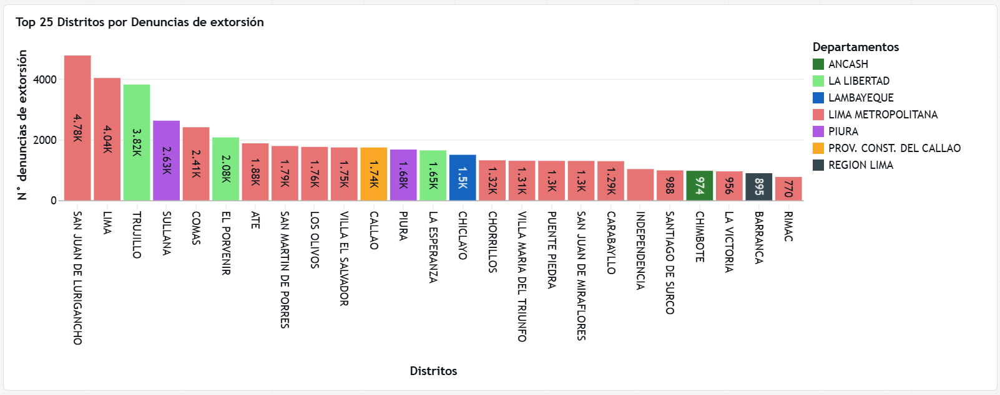

# SmartData - Final Project - Top 25 Distritos con más extorsiones en el Perú

## 📃 Descripción
Proyecto final de Data Engineering con Azure Databricks de SmartData 🤖. Este proyecto presenta, a través de un análisis minucioso, __los 25 distritos con más casos de extorisión denunciados en el Perú en los últimos 5 años (desde enero 2021 hasta setiembre de 2025)__. Hola, mi nombre es Cristian Tinipuclla, soy Ingeniero de Sistemas de la USIL 🧑‍💻 y, debido a la realidad que atraviesa nuestro país respecto a la seguridad ciudadana, me vi en la necesidad de buscar fuentes de datos  y armar este proyecto para mostrarte cuáles son los 25 distritos con más casos de extorsión. La extorsión se ha convertido en el principal problema que nuestro país atraviesa y que queremos que pare ya 🥲. Este no solo es un proyecto, es una muestra de la realidad de nuestro país para poder reflexionar y poder hacer algo a partir de ello c:

## 📊 Dashboard


## 📁 Estructura del proyecto

```
sd-fp-extortions-in-peru/
├── .github/
│   └── workflows/
│       └── deploy-notebook.yml
├── dashboard/
│   ├── Denuncias de Extorsión por Distrito — Perú.lvdash.json
│   ├── Dashboard.png
│   └── Link de dashboard.txt
├── datasets/
│   ├── crime-reports.csv
│   ├── crimes.csv
│   └── months.csv
├── evidencias/
│   ├── containers.png
│   ├── estructura-de-carpetas.png
│   ├── Github-Actions.png
│   ├── servicios_aprovisionados.png
│   ├── usuarios_ficticios_grant_medallion.png
│   └── workflow_executed.png
├── PrepAmb/
│   └── 1.Preparacion_Ambiente.ipynb
├── proceso/
│   ├── 1.Preparacion_Ambiente.ipynb
│   ├── 2.Ingest_crime_reports.ipynb
│   ├── 2.Ingest_crimes_and_months.ipynb
│   ├── 3.Transform.ipynb
│   ├── 4.Load.ipynb
│   └── 5.Grants_Medallion.ipynb
├── reversion/
│   └── 1. Drop-Medallion.ipynb
├── seguridad/
│   └── 5.Grants_Medallion.ipynb
└── README.md
```

| Carpeta | Descripción |
| --- | --- |
| `.github/` | Workflow de GitHub Actions para el CI/CD de despliegue de notebooks entre ambientes (dev → prod). |
| `dashboard/` | Contiene el dashboard de Databricks (.lvdash.json), su captura en imagen y el link de acceso directo. |
| `datasets/` | Archivos CSV fuente con los datos de denuncias por delitos, tipos de crímenes y meses. Se cargan en el container _raw_ del datalake. Fuente: [SIDPOL - MININTER](https://www.gob.pe/institucion/mininter/informes-publicaciones/7304416-base-de-datos-del-sidpol-a-setiembre-del-2025) |
| `evidencias/` | Capturas de pantalla que documentan la configuración de servicios en Azure, containers, grants y ejecución del workflow. |
| `PrepAmb/` | Notebook de preparación inicial del ambiente en Databricks (catálogos, schemas, volúmenes). |
| `proceso/` | Notebooks principales del pipeline ETL: preparación del ambiente, ingesta (bronze), transformación (silver) y carga (golden), junto con la asignación de permisos. |
| `reversion/` | Notebook para hacer rollback eliminando las tablas de la arquitectura medallion en caso de ser necesario. |
| `seguridad/` | Notebook dedicado a la gestión de permisos y grants sobre las capas de la arquitectura medallion. |

## ✏️ Pasos para replicar este proyecto

### Setup en Azure
1. El proyecto está hecho en Azure Databricks, por ende debes tener una cuenta de Azure. Puede ser gratis. Para ello, ve al siguiente link: https://azure.microsoft.com/es-mx/pricing/purchase-options/azure-account
2. Dentro de Azure, realizar el setup de los servicios que necesitaremos, para ello, seguiremos los pasos del siguiente manual: [Manual Unit Catalog](https://www.notion.so/Unit-Catalog-1ca71e129a518042a734c49a459d7646). De tener alguna duda o inconveniente, no dudes contactame por correo o por LinkedIn 🤗 (Contactos al final 👇).
3. En el datalake de Azure, crear los siguientes containers:
  - raw
  - bronze
  - silver
  - golden
  - catalog
4. Agregar los datasets de esta repo en el container __raw__.
5. En el paso 2 ya se creó un servicio de Azure Databricks. Crear uno adicional para que simule el ambiente productivo. __IMPORTANTE__: Ambos servicios tienen que estar en una misma región. Ejemplo _East US 2_.
6. Hasta el momento tenemos dos servicios de A. Databricks 🧱: 
- __Azure Databricks dev__, que se creó en el _paso 2_ y que simulará el ambiente de desarrollo.
- __Azure Databricks prod__, creado en el _paso 5_ y que simulará el ambiente de producción. 
7. Ir al servicio de Azure Databricks productivo y crear cluster __cluster_SD__. Tendrá que tener dicho nombre para que después sea referenciado en el _deploy_notebook.yml_. Aquí hay un ejemplo de cómo crear un cluster: [Creación de cluster](https://share.evernote.com/note/fcfbfd2f-fdf4-6c82-1f86-a611be1c353a)

### Setup de proyecto en Azure Databricks
Aquí no solo clonaremos nuesta repo en Azure Databricks, sino que necesitamos añadir nuestra credencial Git en Databricks para poder hacer push y pull entre Databricks y Github. 
1. En nuestro Databricks ir a __Settings>Linked accounts>Git integrations__ y completar los campos debidos. Si no cuentas con una Git Credential, desde tu Github, ir a __Setting>Developer settings>Personal access token>tokens>Generate new token__
2. Crea tu repo en Github y luego una rama llamada _construccion_.
4. Clona tu repo en tu A. Databricks desarrollo. Para ello, dentro de A. Databricks ir a __Workspace>Create>Git folder__  y pegar el link de tu repo.
5. De la misma forma, ahora clona esta repo también en tu A. Databricks desarrollo
6. Entra a tu repo y cambia a la rama _construccion_. Luego, traslada el contenido de mi repo al tuyo.

### Setup de pipeline Github Actions
Para poder ejecutar el workflow _deploy_notebook.yml_, el cual hará el despliegue de notebooks de A. Databricks dev a prod, se deben crear los secrets en __Github__. Pero antes, se deben crear los __Access tokens de Databricks__ :
1. En Databricks dev, ir a la siguiente ruta: __settings>developer>manage>generate new token__ y completar los siguientes campos:
- Name: Github.
- Lifetime: 30 days.
- all-apis
2. El mismo paso anterior, replicarlo en Databricks prod.
3. Ahora sí, creamos los 4 secrets en Github. Ir a __repo>Settings>Secrets and variables>Actions>New repository secret__ y crear lo siguiente:
- DATABRICKS_ORIGIN_HOST: El valor es el link del Databricks dev hasta el .net. 
- DATABRICKS_ORIGIN_TOKEN: Valor del token de Databricks dev (_Paso 1_)
- DATABRICKS_DEST_HOST: El valor es el link del Databricks prod hasta el .net.
- DATABRICKS_DEST_TOKEN: Valor del token de Databricks prod. (_Paso 2_)
4. En tu repo en A. Databricks dev, ir al archivo _deploy_notebook.yml_ y cambiar los siguientes valores:
- Paths: En las líneas __20, 133, 147, 169, 191, 215, 236__. Ya que ahora estás en tu repo, tendrás que adecuar las rutas en las líneas mencionadas.
- Storage_name: En las líneas __136, 153 y 175__. Estos indican el nombre de tu datalake. Por ende tendrás que adecuarlo al nombre con el que lo creaste.

### Push y deployment de workflow

Con todos los cambios realizados anteriormente, estamos listos para hacer push desde nuestro repo en A. Databricks. 
1. En A. Databricks dev, dar clic en la rama construccion y realizar push.
2. En Github, crear Pull Request yendo a la pestaña __Pull Requests>New pull request__.
3. Una vez realizado el pull request y merge, ir a pestaña __Actions__ y verificar que el pipeline se ejecute correctamente.
4. Ir a A. Databricks dev y corroborar despliegue completo de nuestro proyecto y workflow en sección _Job and Pipelines_
5. Listo! Si has seguido todos los pasos correctamente, deberías haber desplegado todo el proyecto en tu repositorio con éxito. 🙌. De todas formas, si te pareció confuso algún paso o tuviste algún inconveniente, ¡no dudes en contactarme! 👇 Estamos para aprender juntos 🤗🤩


## 👤 Autor

**Cristian Tinipuclla**

QA | Data Engineering | USIL

[](https://www.linkedin.com/in/crisjhatin/)
[](mailto:cristianjhair2000@gmail.com)
